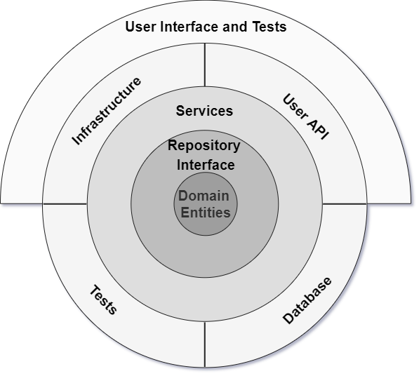

# CleanArchitecture
## Goals
- Placing the project's primary focus on the core domain and domain logic
- Basing complex designs on a model of the domain
- The architecture is comprised of multiple concentric layers interfacing each other towards the core that represents the domain using the inversion of control principle
- The architecture does not depend on the data layer as in classic multi-tier architectures, but on the actual domain models.
- Move all coupling towards the center

## Domain Entities
- this layer represents the business and behavior objects
- all the domain entities should be here. 
- these domain entities don’t have any dependencies
- domain entities are flat, without any heavy code and/or business logic 
- should define a structure
- The domain entities project should have no reference to outside projects (e.g. EF, ASP.NET core, MVC, DI) or any other project in the solution.

## Repository Interface
- creates an abstraction between the domain entities and business logic of an application
- we typically add interfaces that provide object saving and retrieving behavior without coupling the code to a data source like a DB
- consists of the data access pattern, which is a more loosely coupled approach to data access
- create a generic repository, and add queries to retrieve data from the source, map the data from data source to a business entity, and persist changes in the business entity to the data source
- The project should have no reference to outside project (e.g. EF, ASP.NET core, MVC, DI) or any other project in the solution except the domain entities project.
- The methods in the repositories should be simple CRUD methods that will just make a wrapper over the DB. 

## Services
- this layer is used to communicate between the UI layer and repository layer
- Holds the business logic
- In this layer, service interfaces are kept separate from their implementation
- keeping loose coupling and separation of concerns in mind
- All the classes that will be used by the outside layer should be internal and have corresponding interfaces. 
- the repository will be referenced using the interfaces and a DI system will inject the corresponding implementation 

## Tests
- Here we should have unit tests for the entire business. All the services should be tested mocking the Repositories. 
- The unit tests will not be done for the Database layer (where the repositories are implemented). This will  allow us to have very fast unit tests that are not data coupled 

## Database
- Here we should have all the repositories interfaces implemented.
- The repositories should be simple and should have no business logic. We should have simple CRUD methods. 

## Infrastructure
- All the 3rd party implementations should go here. 
- For each external wrapper we should have an interface in the services layer. 
- A DI mechanism should be designed and implemented to retrieve the interface implementation for the services and the repositories.

## User API
- This is a layer between the Services and the actual UI. 
- This layer will call the Services layer
- We should have here a transformation process from domain models to UI models. 
- A UI model should be as simple as possible. Should contain mostly strings and bools.
- All the formation and data processing should be done here. 
- For each external wrapper we should have an interface in the services layer. 
- A DI mechanism should be designed and implemented to retrieve the interface implementation for the services and the repositories.

## UI and UI API Tests
- The UI layer should be as light as possible. This is because it is hard to test a actual UI so to be able to have a good coverage we make sure we have most of the code in the User API and the UI will just display some strings 
- All the computation and data processing should be done in the User API
- If we have a web app with a lot of JS the JS part should be considered as a separate system and a similar architecture should be designed for that. In that situation the UI here is actually the API JSon returned.
- Unit tests should be added here to test the User API

## DI
- A DI system should be implemented to put all the dependencies together. 

## Benefits
- layers are connected through interfaces. Implantations are provided during run time.
- Application architecture is built on top of a domain model.
- All external dependency, like database access and service calls, are represented in external layers.
- No dependencies of the Internal layer with external layers.
- Couplings are towards the center.
- Flexible and sustainable and portable architecture.
- No need to create common and shared projects.
- Can be quickly tested because the application core does not depend on anything.
